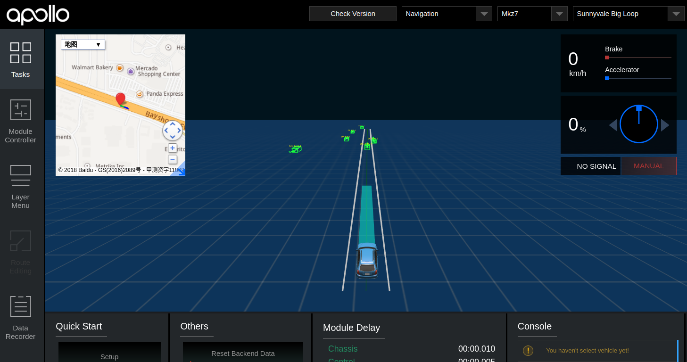

# How to Launch and Run Apollo 
First check and make sure you are in development docker container before you proceed. Now you will need to build from the source. If you want to run the entire system, make sure you have an
nVidia GPU and that you have installed the Linux nVidia drivers.
You could still proceed with the next few steps even if you are missing the Linux nVidia drivers, as the system will run but with the CUDA-based perception and other modules.
```
# To get a list of build commands
./apollo.sh
# To make sure you start clean
./apollo.sh clean
# This will build the full system and requires that you have an nVidia GPU with nVidia drivers loaded
bash apollo.sh build
```

If you do not have an nVidia GPU, the system will run but with the CUDA-based perception and other modules. You must
specify either `dbg` for debug mode or `opt` for optimized code

```
./apollo.sh build_no_perception dbg
```

If you make modifications to the Dreamview frontend, then you must run `./apollo.sh build_fe`  before you run the
full build.

If the computer is very slow, you can enter the following command to limit the CPU.

```
bash apollo.sh build --local_resources 2048,1.0,1.0
```


## Run Apollo

Follow the steps below to launch Apollo. Note that you must build the system first before you run it. Note that the
bootstrap.sh will actually succeed but the user interface will not come up if you skip the build step.

### Start Apollo

Running Apollo will start the ROS core and then startup a web user interface called Dreamview, this is handled by
the bootstrap script, so from within the docker container, you should run:

```
# start module monitor
bash scripts/bootstrap.sh
```

### Access Dreamview
Access Dreamview by opening your favorite browser, e.g. Chrome, go to http://localhost:8888 and you should see this screen
However, there will be nothing running in the system.


### Select Drive Mode
From the dropdown box selet "Navigation" mode.


### Replay demo rosbag

To see if the system works, use the demo recording which feeds the system.
 ```
     cyber_recorder play -f docs/demo_guide/demo_3.5.record --loop
 ```
 The `--loop` option enables record to keep playing the bag in a loop playback mode.


Dreamview should show a running vehicle now. (The following image might be different due to changes in frontend.)


